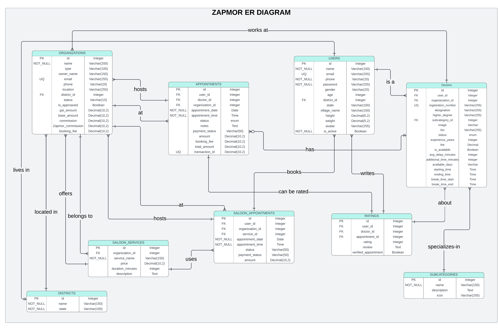

# 🏥 Zapmor - Healthcare Appointment Booking Platform

**A comprehensive RESTful API for healthcare appointment booking, featuring doctor consultations, clinic management, and beauty/wellness services.**


---
## 🎯 Overview

Zapmor is a full-featured healthcare platform backend that enables patients to:
- Search and book appointments with qualified doctors
- Browse clinics and healthcare organizations
- Access beauty and wellness services
- Leave reviews and ratings
- Manage their profile and appointment history

The platform supports multiple service types (medical consultations, beauty services) and provides comprehensive management tools for healthcare providers.

**Development URL:** `http://localhost:8000/api` (Local)

---

## ✨ Features

### 👥 User Management
- User registration with email/phone verification
- Secure JWT-based authentication (Laravel Sanctum)
- User profile management (personal details, medical history)
- Password reset and change functionality
- Soft deletes for data safety

### 👨‍⚕️ Doctor Management
- Doctor profiles with specialization and credentials
- Experience level and qualification tracking
- Availability calendar with time slots
- Appointment scheduling with automatic slot management
- Doctor ratings and verified reviews system
- Status tracking (approved, pending, rejected)

### 🏥 Clinic & Organization Management
- Multi-type organization support (clinics, saloons)
- Location-based search with district filtering
- Clinic facilities and information
- Commission and fee management
- Approval workflow for new providers

### 📅 Appointment System
- Real-time slot availability checking
- Appointment booking with automatic conflict detection
- Appointment status tracking (booked, completed, cancelled, no-show)
- Payment integration ready (pending/completed/failed)
- Cancellation with automatic refund processing
- Appointment notes and communication

### ⭐ Reviews & Ratings
- Verified appointment-based reviews
- 5-star rating system
- Review editing and deletion (within 7 days)
- Doctor rating aggregation and statistics
- Spam prevention and moderation ready

### 💇 Beauty & Wellness Services
- Saloon service catalog management
- Service pricing and duration tracking
- Service-based appointment booking
- Independent management from medical appointments

### 🔍 Search & Discovery
- Multi-criteria search (doctor, clinic, service, location)
- District-based filtering
- Specialty-based filtering
- Pagination and sorting
- Real-time availability display

---

## 🛠 Tech Stack

### Backend
- **Framework:** Laravel 10+
- **Language:** PHP 8.0+
- **Database:** MySQL 8.0+
- **API Authentication:** Laravel Sanctum (JWT tokens)
- **ORM:** Eloquent

### Development Tools
- **Package Manager:** Composer
- **API Documentation:** Postman
- **Version Control:** Git
- **Environment Management:** .env configuration
---

## 📁 Project Structure

```
zapmor-api/
├── app/
│   ├── Http/
│   │   ├── Controllers/          # 12 Controllers (Auth, Doctor, Appointment, etc.)
│   │   └── Requests/             # Form request validation (4 classes)
│   ├── Models/                   # 9 Eloquent models with relationships
├── database/
│   ├── migrations/               # 9 Database migrations
│   └── seeders/                  # DatabaseSeeder with sample data
├── routes/
│   └── api.php                   # 33 API endpoints defined
├── config/
│   ├── database.php              # MySQL configuration
│   ├── app.php                   # Application settings
│   └── cors.php                  # CORS configuration
├── storage/
│   └── logs/                     # Application logs
├── tests/
│   └── Feature/                  # API integration tests
├── .env.example                  # Environment template
├── composer.json                 # PHP dependencies
└── README.md                     # This file
```
---
### ER Diagram

<p align="center">
  
</p>

<p align="center">
  <i>Entity Relationship Diagram of the Zapmor database</i>
</p>
---
## 🚀 Quick Start

### Prerequisites
- PHP 8.0 or higher
- MySQL 8.0 or higher
- Composer
- Git

### 5-Minute Setup

```bash
# 1. Clone the repository
git clone https://github.com/bidhannath2001/Industrial_Attachment_At_Tori_IT.git
cd zapmor-api

# 2. Install dependencies
composer install

# 3. Setup environment
cp .env.example .env
php artisan key:generate

# 4. Configure database (in .env)
DB_CONNECTION=mysql
DB_HOST=127.0.0.1
DB_PORT=3306
DB_DATABASE=zapmor_dev
DB_USERNAME=root
DB_PASSWORD=

# 5. Run migrations & seed
php artisan migrate
php artisan db:seed

# 6. Start server
php artisan serve

# API is now available at http://localhost:8000/api
```

**Server will be running at:** `http://localhost:8000`  
**Test endpoint:** `curl http://localhost:8000/api/doctor/`

---

## 📝 Installation

### Step 1: Clone Repository

```bash
git clone https://github.com/bidhannath2001/Industrial_Attachment_At_Tori_IT.git
cd zapmor-api
```

### Step 2: Install Dependencies

```bash
composer install
```

### Step 3: Environment Configuration

```bash
# Copy environment file
cp .env.example .env

# Generate application key
php artisan key:generate
```

### Step 4: Database Setup

#### Create MySQL Database named 'zapmor_dev'

#### Configure .env

```env
DB_CONNECTION=mysql
DB_HOST=127.0.0.1
DB_PORT=3306
DB_DATABASE=zapmor_dev
DB_USERNAME=root
DB_PASSWORD=
```

### Step 5: Migrate & Seed Database

```bash
# Run all migrations
php artisan migrate

# Seed sample data
php artisan db:seed

# Verify tables were created
mysql -u zapmor_user -p zapmor_dev -e "SHOW TABLES;"
```

### Step 6: Start Development Server

```bash
php artisan serve
```

Server runs at: `http://localhost:8000`

### Step 7: Test Installation

```bash
# Test API connectivity
curl http://localhost:8000/api/doctors/

# Should return JSON response with doctors list
```

---

## ⚙️ Configuration

### Key Environment Variables

```env
# Application
APP_NAME=Zapmor
APP_ENV=local
APP_DEBUG=true
APP_URL=http://localhost:8000

# Database
DB_CONNECTION=mysql
DB_HOST=127.0.0.1
DB_PORT=3306
DB_DATABASE=zapmor_dev
DB_USERNAME=root
DB_PASSWORD=

# Authentication
SANCTUM_STATEFUL_DOMAINS=localhost:3000,localhost:8100
```

### Sanctum Configuration

```bash
# Publish Sanctum config
php artisan vendor:publish --provider="Laravel\Sanctum\SanctumServiceProvider"

# Configure in config/sanctum.php
'stateful' => explode(',', env('SANCTUM_STATEFUL_DOMAINS', 'localhost,localhost:3000,localhost:8100')),
```

---

## 🗄️ Database Schema

### 9 Core Tables

| Table | Purpose | Records |
|-------|---------|---------|
| **users** | System users/patients | Dynamic |
| **districts** | Geographic areas | ~500+ |
| **doctors** | Healthcare providers | Dynamic |
| **organizations** | Clinics/saloons | Dynamic |
| **subcategories** | Doctor specializations | ~20+ |
| **appointments** | Doctor bookings | Dynamic |
| **ratings** | Doctor reviews | Dynamic |
| **saloon_services** | Beauty services | Dynamic |
| **saloon_appointments** | Beauty bookings | Dynamic |

### Entity Relationships

```
Users → Districts (many-to-one)
Users → Appointments (one-to-many)
Users → Ratings (one-to-many)

Doctors → Users (one-to-one, inheritance)
Doctors → Organizations (many-to-one)
Doctors → Subcategories (many-to-one)
Doctors → Appointments (one-to-many)
Doctors → Ratings (one-to-many)

Organizations → Districts (many-to-one)
Organizations → Appointments (one-to-many)
Organizations → Saloon-Services (one-to-many)
Organizations → Saloon-Appointments (one-to-many)

Appointments → Users (many-to-one)
Appointments → Doctors (many-to-one)
Appointments → Ratings (one-to-many, verification)

Ratings → Users (many-to-one)
Ratings → Doctors (many-to-one)
Ratings → Appointments (many-to-one, verified)

Saloon-Services → Organizations (many-to-one)
Saloon-Appointments → Users (many-to-one)
Saloon-Appointments → Organizations (many-to-one)
Saloon-Appointments → Saloon-Services (many-to-one)
```

## 🔌 API Endpoints

### Public Endpoints (No Authentication)

**Authentication:**
- `POST /auth/register` — Register new user
- `POST /auth/login` — User login (returns token)

**Doctors:**
- `GET /doctors` — List all doctors (with filters & pagination)
- `GET /doctors/{id}` — Get doctor details
- `GET /doctors/{id}/available-slots` — Get available appointment slots
- `GET /doctors/by-district/{districtId}` — Filter by district
- `GET /doctors/by-subcategory/{subcategoryId}` — Filter by specialty

**Clinics:**
- `GET /clinics` — List all clinics
- `GET /clinics/{id}` — Get clinic details
- `GET /clinics/by-district/{districtId}` — Filter by district

**Saloons:**
- `GET /saloons` — List all saloons
- `GET /saloons/{id}` — Get saloon details
- `GET /saloons/{id}/services` — Get saloon services

**Miscellaneous:**
- `GET /misc/districts` — List districts
- `GET /misc/subcategories` — List doctor specialties
- `GET /search` — Multi-entity search

### Protected Endpoints (Authentication Required)

**User Authentication:**
- `GET /auth/me` — Get current user
- `POST /auth/logout` — Logout user

**User Profile:**
- `GET /profile` — Get user profile
- `PUT /profile` — Update profile
- `POST /profile/change-password` — Change password

**Appointments:**
- `POST /appointments` — Book appointment
- `GET /appointments` — Get user's appointments
- `GET /appointments/{id}` — Get appointment details
- `PATCH /appointments/{id}/cancel` — Cancel appointment

**Reviews:**
- `POST /reviews` — Write review
- `PUT /reviews/{id}` — Update review
- `DELETE /reviews/{id}` — Delete review

**Saloon Appointments:**
- `POST /saloon-appointments` — Book saloon service
- `GET /saloon-appointments` — Get user's saloon bookings
- `PATCH /saloon-appointments/{id}/cancel` — Cancel booking

**Total:** 33 endpoints across 12 controllers

---

## 🔐 Authentication

### Token-Based Authentication (JWT via Sanctum)

#### Login Flow

```bash
# 1. Register
POST /auth/register
{
    "name": "John Doe",
    "email": "john@example.com",
    "phone": "9876543210",
    "password": "SecurePass123!",
    "password_confirmation": "SecurePass123!",
    "gender": "Male",
    "age": 28,
    "district_id": 1,
    "state": "Maharashtra",
    "village_name": "Downtown"
}

# Response includes token:
{
    "success": true,
    "data": {
        "user": {...},
        "token": "1|abcdefghijklmnopqrstuvwxyz..."
    }
}

# 2. Use token in protected requests
Authorization: Bearer 1|abcdefghijklmnopqrstuvwxyz...
```

#### Token Management

```php
// Generate token
$token = $user->createToken('auth-token')->plainTextToken;

// Verify token
auth()->user(); // Returns User instance

// Revoke token
auth()->user()->tokens()->delete();
```

#### Middleware Protection

```php
// Routes protected with Sanctum
Route::middleware('auth:sanctum')->group(function () {
    Route::post('/appointments', [AppointmentController::class, 'store']);
    Route::get('/profile', [ProfileController::class, 'show']);
});
```

---

## 🧪 Testing
### API Testing with Postman

1. **Import Collection:** Import `postman-collection.json` to Postman
2. **Set Environment:**
   - Base URL: `http://localhost:8000/api`
   - Auth Token: Generate from login endpoint
3. **Run Requests:** Use included test examples in documentation

### Manual Testing with cURL

```bash
# Test register
curl -X POST http://localhost:8000/api/auth/register \
  -H "Content-Type: application/json" \
  -d '{
    "name": "Test User",
    "email": "test@example.com",
    "phone": "9876543210",
    "password": "password123",
    "password_confirmation": "password123",
    "gender": "Male",
    "age": 25,
    "district_id": 1,
    "state": "Maharashtra",
    "village_name": "Test"
  }'
```

### Sample Test Data

**Seeder adds:**
- 10 sample users
- 5 districts
- 8 doctors with specializations
- 3 organizations (clinics/saloons)
- 6 saloon services
- Sample appointments and ratings

Run seeder: `php artisan db:seed`
---

## 👨‍💻 Author & Support

**Project Lead:** Bidhan Nath  
**Created:** September 2026  
**Institution:** Premier University, Bangladesh  


**Made with ❤️ by Bidhan Nath**
---

## 📞 Connect
- **LinkedIn:** [https://linkedin.com/in/bidhan-nath-399b43239]
- **Portfolio:** [https://bidhankn.netlify.app/]

---
**Happy coding! 🚀**
